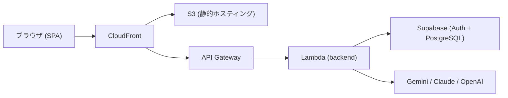
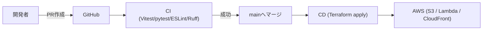

# AdaptSheet AI

エンジニアが保守しやすいHTML/CSS帳票を、AIの力で構築・管理するプラットフォーム。生成AI（Gemini/Claude/OpenAI）へPDFを直接読み取らせる生成と、AIを介さない変換エンジン（Docling/pdf2htmlEX/PyMuPDF）を描画ボタンの隣で選べるモデル選択機能、リアルタイムプレビューを統合したSPA。

帳票作成という題材を通じて、**CI/CD・AWS・Supabase・生成AI・AI駆動開発（ClaudeCodeとの協働）の技術キャッチアップ**を目的に作られている。個人開発の範囲でも、コア機能の高速なイテレーションと、本番運用に耐えるインフラ・セキュリティ設計の両方を一通り経験することを狙う。

本番環境: https://d3lal8vccjsy5y.cloudfront.net/

詳細な構想・要件は [`planning/brainstorm.md`](./planning/brainstorm.md)、開発の進め方は [`DEVELOPMENT.md`](./DEVELOPMENT.md) を参照。

## システム構成

一目でわかる概要のみ。非同期ジョブ経路・内部Lambda・DBスキーマ・ログ相関などの詳細は [`docs/architecture.md`](./docs/architecture.md) を参照。

- フロントとAPIは同一オリジン（CloudFront配下の`/api/*`）で配信し、静的アセットはS3、APIはLambda（FastAPI）が処理する。
- 生成AI（Gemini/Claude/OpenAI）は応答が数十秒かかることがあり、API Gatewayの29秒タイムアウトを超えうるため、S3署名付きURLアップロード＋別Lambdaへの非同期起動で処理する。AIを介さない変換エンジン（Docling/pdf2htmlEX/PyMuPDF）は常に高速なため同期処理のままにしている。
- Docling/pdf2htmlEXはbackendからのみ呼ばれる内部Lambda（AWS_IAM認証必須のFunction URL）。
- 認証・生成履歴の永続化はSupabase（Auth + PostgreSQL）に委譲する。

## セキュリティ概要

一目でわかる概要のみ。認証フロー・RLSポリシー・脅威モデル等の詳細は [`docs/architecture.md`](./docs/architecture.md#3-認証認可の仕組みの構成図) と [`docs/decisions.md`](./docs/decisions.md#adr-020-認証のセキュリティ強化jwt検証方式ログイン手段の限定rlsxss対策) を参照。

- **認証**: Supabase Auth（Google OAuthのみ、認可コード＋PKCE）。新規登録UIは提供せず、アカウント発行は`scripts/create_user.sh`に限定する。
- **認可**: バックエンドはJWTをfail-closedで検証する（未設定・検証失敗は常に未ログイン扱い）。生成AI標準プラン（Gemini標準/Claude/OpenAI）は未ログインなら403、生成履歴はPostgreSQLの行レベルセキュリティ（RLS）で本人の行のみに制限する。
- **トークン保管**: `sessionStorage`に限定し、プレビューiframeの`sandbox`化・CSPと合わせて多層防御でXSS経由の窃取経路を塞ぐ。
- **秘密情報の管理**: APIキー等はイメージに焼き込まず、Lambdaのコールドスタート時にAWS Systems Manager Parameter Storeから取得する。
- **CI/CDの認証**: GitHub ActionsはOIDCで短期認証情報を発行し、長期のAWSアクセスキーを持たない。
- **レート制限**: API Gatewayのステージ単位スロットリングで過度なAPIコールを防ぐ。

## CI/CD概要

PRごとにフロント（Vitest/ESLint/vite build）・バック（pytest/ruff）をGitHub Actionsで自動実行し、全て成功しないとmainへマージできない（Branch Protection）。mainへのマージをトリガーに、Terraformでインフラを適用しS3・Lambdaへ自動デプロイする。詳細は [`docs/deployment.md`](./docs/deployment.md) を参照。

## 技術スタック

- **フロントエンド**: React / TypeScript / Vite / Zustand / shadcn/ui / TailwindCSS
- **バックエンド**: Python / FastAPI / PyMuPDF / Docling / pdf2htmlEX / Gemini SDK / Anthropic SDK / OpenAI SDK / SQLAlchemy
- **型同期**: openapi-typescript（FastAPIの`openapi.json`からフロント用TypeScript型を生成）
- **テスト**: Vitest + React Testing Library + MSW / pytest / Playwright
- **インフラ**: Terraform / AWS (Lambda, CloudFront, S3, API Gateway) / GitHub Actions
- **ツールバージョン管理**: mise（ホスト側で直接実行するツールを`mise.toml`で固定）
- **認証・DB**: Supabase（Auth + PostgreSQL）

## クイックスタート

開発環境の構築・起動手順は [`docs/quickstart.md`](./docs/quickstart.md) にまとめている。

## ドキュメント一覧

| ドキュメント | 内容 |
|---|---|
| [CLAUDE.md](./CLAUDE.md) | ClaudeCode向けの開発ルール・コマンド定義 |
| [DEVELOPMENT.md](./DEVELOPMENT.md) | 開発ロードマップ（フェーズ・ステップ） |
| [planning/brainstorm.md](./planning/brainstorm.md) | 初期構想・要件・技術選定メモ |
| [docs/quickstart.md](./docs/quickstart.md) | ローカル開発環境の構築・起動手順 |
| [docs/spec.md](./docs/spec.md) | 要件定義、画面仕様、APIインターフェース |
| [docs/architecture.md](./docs/architecture.md) | アーキテクチャ図（システム構成・認証・API・セキュリティ・CI/CD・DB・ログ） |
| [docs/decisions.md](./docs/decisions.md) | アーキテクチャ決定記録 (ADR) |
| [docs/deployment.md](./docs/deployment.md) | デプロイ手順・運用の手引き |
| [docs/observability.md](./docs/observability.md) | ログの見方・相関のたどり方・アラーム対応 |
| [docs/supabase-local-cli-setup.md](./docs/supabase-local-cli-setup.md) | Supabase Local CLIによるログイン機能のローカル検証手順 |
