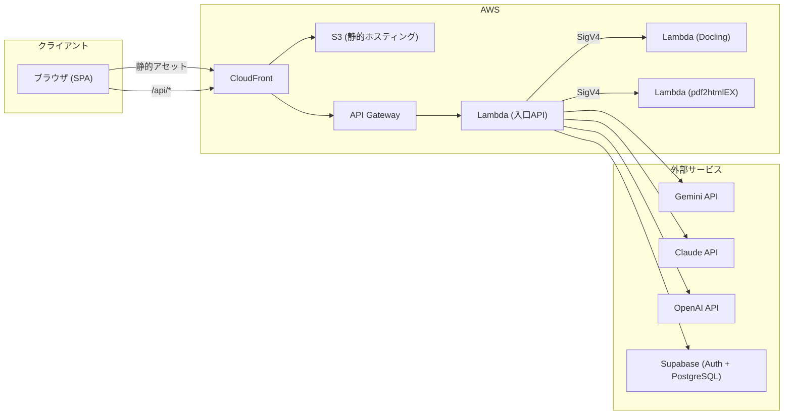
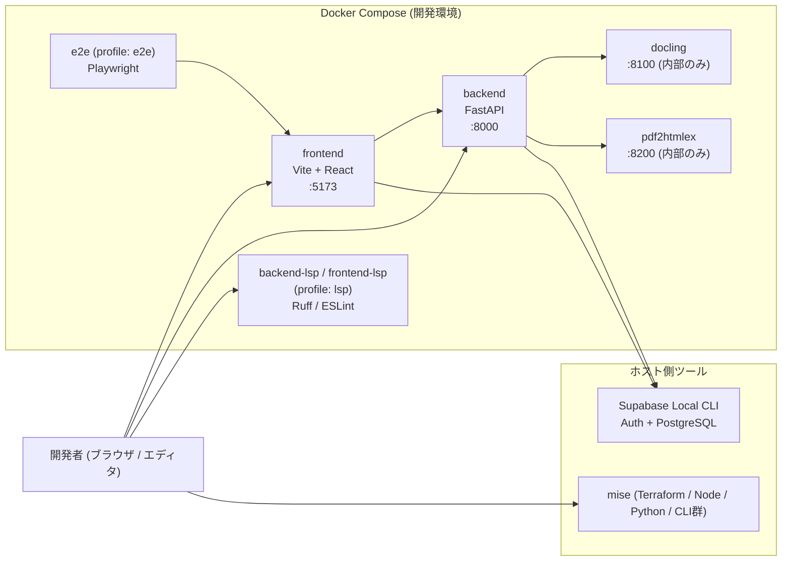
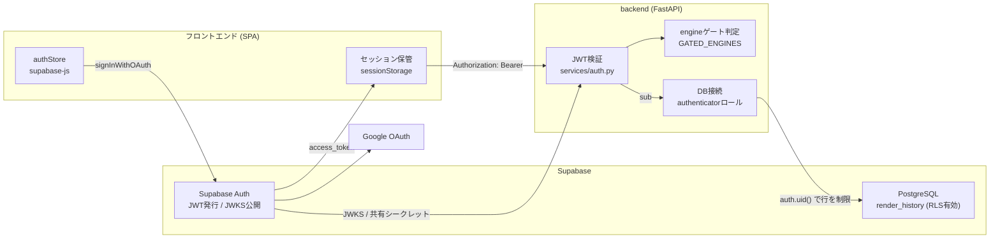
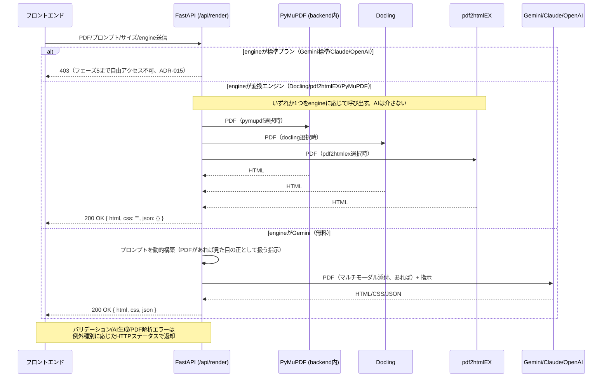
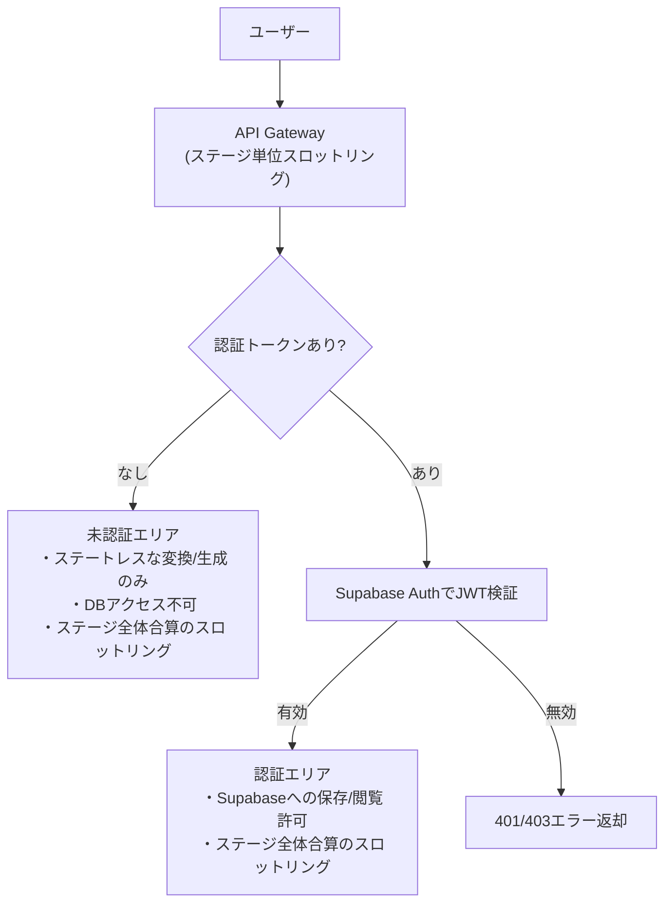
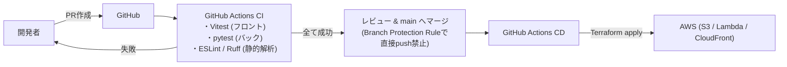

# アーキテクチャ設計書

`adapt-sheet` のシステム構成・API設計・セキュリティ・CI/CDの概要をMermaid.jsで記述する。技術選定の理由は [`decisions.md`](./decisions.md) を参照。

---

## 1. システム構成図

本番環境の構成要素と接続関係のみを示す（処理の分岐やゲート判定は「4. バックエンドAPI設計概要図」を参照）。

- フロントとAPIは同一オリジン（CloudFront配下の`/api/*`）で提供する（ADR-029）。
- 入口Lambdaは`FastAPI + Lambda Web Adapter`で動き、PyMuPDFによるレイアウト変換を内包する（ADR-014）。
- Docling/pdf2htmlEXの各Lambdaは内部専用で、API Gatewayを介さずAWS_IAM認証必須のFunction URLとして公開する（ADR-026）。
- 生成AIへはPDFをマルチモーダル入力として直接添付する（ADR-015）。

---

## 2. 開発環境の構成図

`docker compose up --build` で起動する開発環境（`docker-compose.yml`、ADR-010）。ホストへ公開するのは frontend(5173) と backend(8000) のみで、変換系サービスはCompose内部ネットワークからのみ到達できる。

- 生成AIはpytest・ローカル開発とも既定でモック（`USE_MOCK_AI=true`）を経由し、実APIを叩かない。
- `e2e` と `*-lsp` は `profiles` によるopt-inで、常時起動しない（ADR-010/024）。
- Docling用のMLモデルは名前付きボリュームへ永続化し、コンテナ再作成時の再ダウンロードを避ける。
- ホスト側ツールのバージョンは `mise.toml` で固定する（ADR-023）。

---

## 3. 認証認可の仕組みの構成図

認証はSupabase Auth（Google OAuth、認可コード＋PKCE）に委譲し、バックエンドはJWTを検証するだけでセッションを持たない（ADR-020/021）。

- トークンは `sessionStorage` に保持し、タブを閉じた時点で破棄する（ADR-021）。
- 検証鍵は署名方式で切り替わる（`HS256`は共有シークレット、`ES256`/`RS256`はJWKS。ADR-020）。設定が無い場合は常に未ログイン扱い（fail-closed）。
- 認可は2段構え。ゲート対象engine（`gemini`/`claude`/`openai`）は未ログインなら403 `FREE_ACCESS_FORBIDDEN`、履歴データはPostgreSQLのRLSで`auth.uid()`一致行のみに制限する（ADR-019/021）。
- アカウント作成は `scripts/create_user.sh` のみで、画面からの新規登録は提供しない（ADR-021）。

---

## 4. バックエンドAPI設計概要図

`POST /api/render` の処理フロー（詳細仕様は [`spec.md`](./spec.md) 参照）。

エンジン選択（`engine`、ADR-015）により処理が3方向に分岐する。生成AI（Gemini/Claude/OpenAI）はPDFをマルチモーダル入力として直接受け取り、PyMuPDF/Doclingによる事前変換は行わない（HTML/JSON/Doclingテキストは生成AIへ送らない）。Docling/pdf2htmlEX/PyMuPDFはAIを介さず、変換結果をそのまま描画結果として返す。

---

## 5. セキュリティ概要図

未認証エリアと認証エリアのアクセス制御の違い（詳細は [`spec.md`](./spec.md) の要件、決定理由は [`decisions.md`](./decisions.md) を参照）。API Gatewayのステージ単位スロットリングはIPアドレスやユーザーIDを区別せず全体合算でカウントする点に注意（ADR-027）。

---

## 6. CI/CD概要図

---

## 7. データベース（PostgreSQL、ステップ28・ADR-019）

`render_history`テーブル（`backend/app/models.py`）のみ。登録ユーザーが`POST /api/render`を成功させるたびに1行追加される。`user_id`はSupabase Auth（`auth.users.id`）のUUIDをそのまま文字列で持つが、本DBは`auth`スキーマを所有しないため外部キー制約は張らない。

| カラム | 型 | 説明 |
|---|---|---|
| `id` | UUID (PK) | 履歴の一意識別子 |
| `user_id` | string | Supabase JWTの`sub`（`auth.users.id`） |
| `engine` | string | 描画に使ったエンジン（`RenderEngine`のいずれか） |
| `html` / `css` / `json_data` | text / text / json | `POST /api/render`のレスポンスと同一内容 |
| `width_mm` / `height_mm` | float, nullable | 帳票サイズ |
| `created_at` | timestamptz | 保存日時 |

マイグレーションは`backend/migrations/`（Alembic）で管理する。

## 8. 今後の追記予定

- フェーズ4（インフラ構築）着手時に、Terraformモジュール構成図を追加する。
- 保存済み履歴の閲覧UI・名前付きテンプレート機能を追加する際、テーブル設計を拡張する（ADR-019のトレードオフ参照）。
