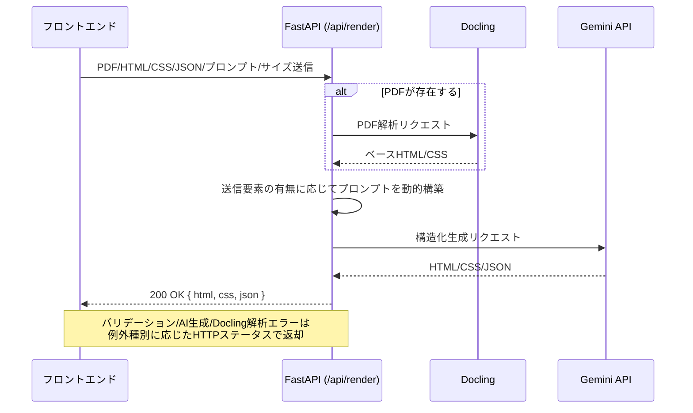
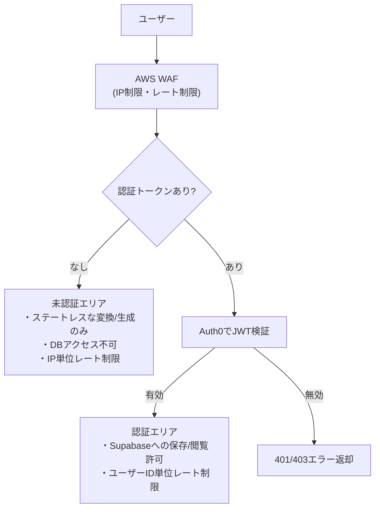
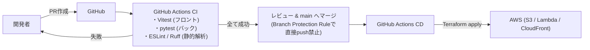

# アーキテクチャ設計書

`adapt-sheet` のシステム構成・API設計・セキュリティ・CI/CDの概要をMermaid.jsで記述する。技術選定の理由は [`decisions.md`](./decisions.md) を参照。

---

## 1. システム構成図

```mermaid
flowchart LR
    subgraph Client["クライアント"]
        Browser["ブラウザ (SPA)"]
    end

    subgraph AWS["AWS"]
        CF["CloudFront"]
        S3["S3 (静的ホスティング)"]
        APIGW["API Gateway"]
        LambdaEntry["Lambda (入口エンドポイント)\nFastAPI + Lambda Web Adapter"]
        LambdaDocling["Lambda (Docling変換)\nDoclingモデル焼き込み済み"]
        WAF["AWS WAF"]
    end

    subgraph External["外部サービス"]
        Gemini["Gemini API (Google AI Studio)"]
        Auth0["Auth0"]
        Supabase["Supabase (PostgreSQL)"]
    end

    Browser -->|静的アセット取得| CF --> S3
    Browser -->|API呼び出し| WAF --> APIGW --> LambdaEntry
    LambdaEntry -->|PDF変換リクエスト (HTTP)| LambdaDocling
    LambdaEntry -->|生成AI呼び出し| Gemini
    LambdaEntry -->|認証トークン検証| Auth0
    LambdaEntry -->|データ保存/取得| Supabase
```

---

## 2. バックエンドAPI設計概要図

`POST /api/render` の処理フロー（詳細仕様は [`spec.md`](./spec.md) 参照）。



---

## 3. セキュリティ概要図

未認証エリアと認証エリアのアクセス制御の違い（詳細は [`spec.md`](./spec.md) の要件、決定理由は [`decisions.md`](./decisions.md) を参照）。



---

## 4. CI/CD概要図



---

## 5. 今後の追記予定

- フェーズ4（インフラ構築）着手時に、Terraformモジュール構成図を追加する。
- フェーズ5（認証・DB統合）着手時に、Supabaseのテーブル設計・ER図を追加する。
