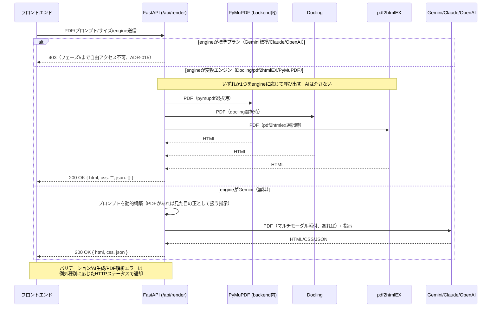
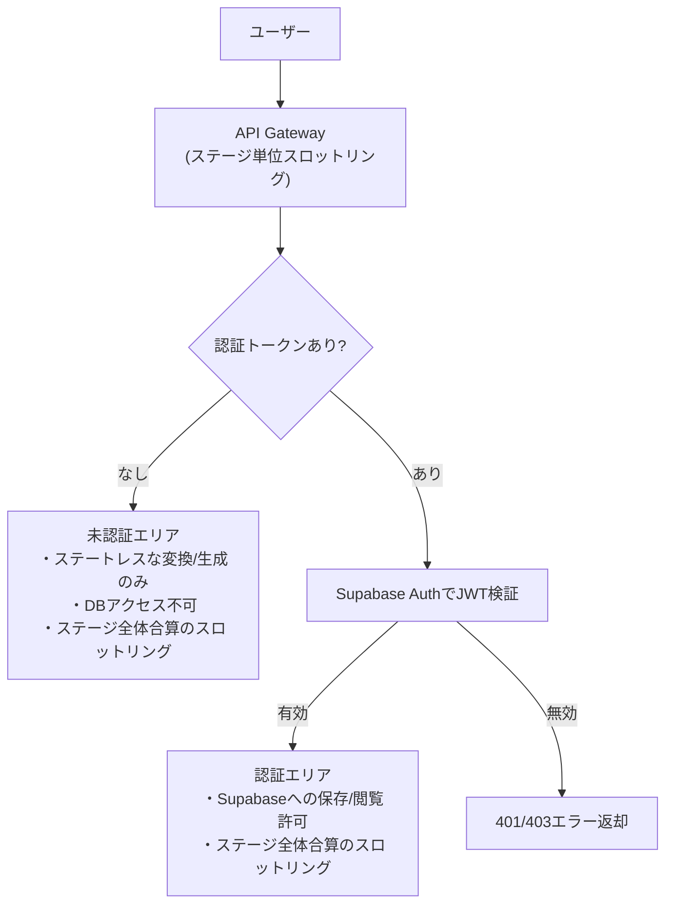
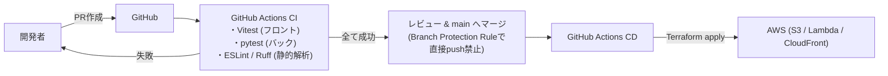

# アーキテクチャ設計書

`adapt-sheet` のシステム構成・API設計・セキュリティ・CI/CDの概要をMermaid.jsで記述する。技術選定の理由は [`decisions.md`](./decisions.md) を参照。

---

## 1. システム構成図

```mermaid
flowchart LR
    subgraph Client["クライアント"]
        Browser["ブラウザ (SPA)"]
    end

    subgraph AWS["AWS"]
        CF["CloudFront"]
        S3["S3 (静的ホスティング)"]
        APIGW["API Gateway"]
        LambdaEntry["Lambda (入口エンドポイント)\nFastAPI + Lambda Web Adapter\nPyMuPDFレイアウト変換を内包 (ADR-014)\nengineごとの分岐・ゲート判定 (ADR-015)"]
        LambdaDocling["Lambda (DoclingのPDF→HTML変換)\nFunction URL・AWS_IAM認証 (ADR-015/026)"]
        LambdaPdf2HtmlEx["Lambda (pdf2htmlEXのPDF→HTML変換)\nFunction URL・AWS_IAM認証 (ADR-015/026)"]
    end

    subgraph External["外部サービス"]
        Gemini["Gemini API (Google AI Studio)"]
        Claude["Claude API (Anthropic)"]
        OpenAI["OpenAI API"]
        Supabase["Supabase (Auth + PostgreSQL)"]
    end

    Browser -->|静的アセット取得| CF --> S3
    Browser -->|API呼び出し (ステージ単位スロットリング, ADR-027)| APIGW --> LambdaEntry
    LambdaEntry -->|変換エンジン選択時・SigV4署名 (HTTP, ADR-026)| LambdaDocling
    LambdaEntry -->|変換エンジン選択時・SigV4署名 (HTTP, ADR-026)| LambdaPdf2HtmlEx
    LambdaEntry -->|生成AI選択時・PDFを直接添付 (ADR-015)| Gemini
    LambdaEntry -->|生成AI選択時・PDFを直接添付 (ADR-015)| Claude
    LambdaEntry -->|生成AI選択時・PDFを直接添付 (ADR-015)| OpenAI
    LambdaEntry -->|認証トークン検証・データ保存/取得| Supabase
```

---

## 2. バックエンドAPI設計概要図

`POST /api/render` の処理フロー（詳細仕様は [`spec.md`](./spec.md) 参照）。

エンジン選択（`engine`、ADR-015）により処理が3方向に分岐する。生成AI（Gemini/Claude/OpenAI）はPDFをマルチモーダル入力として直接受け取り、PyMuPDF/Doclingによる事前変換は行わない（HTML/JSON/Doclingテキストは生成AIへ送らない）。Docling/pdf2htmlEX/PyMuPDFはAIを介さず、変換結果をそのまま描画結果として返す。



---

## 3. セキュリティ概要図

未認証エリアと認証エリアのアクセス制御の違い（詳細は [`spec.md`](./spec.md) の要件、決定理由は [`decisions.md`](./decisions.md) を参照）。API Gatewayのステージ単位スロットリングはIPアドレスやユーザーIDを区別せず全体合算でカウントする点に注意（ADR-027）。



---

## 4. CI/CD概要図



---

## 5. データベース（PostgreSQL、ステップ28・ADR-019）

`render_history`テーブル（`backend/app/models.py`）のみ。登録ユーザーが`POST /api/render`を成功させるたびに1行追加される。`user_id`はSupabase Auth（`auth.users.id`）のUUIDをそのまま文字列で持つが、本DBは`auth`スキーマを所有しないため外部キー制約は張らない。

| カラム | 型 | 説明 |
|---|---|---|
| `id` | UUID (PK) | 履歴の一意識別子 |
| `user_id` | string | Supabase JWTの`sub`（`auth.users.id`） |
| `engine` | string | 描画に使ったエンジン（`RenderEngine`のいずれか） |
| `html` / `css` / `json_data` | text / text / json | `POST /api/render`のレスポンスと同一内容 |
| `width_mm` / `height_mm` | float, nullable | 帳票サイズ |
| `created_at` | timestamptz | 保存日時 |

マイグレーションは`backend/migrations/`（Alembic）で管理する。

## 6. 今後の追記予定

- フェーズ4（インフラ構築）着手時に、Terraformモジュール構成図を追加する。
- 保存済み履歴の閲覧UI・名前付きテンプレート機能を追加する際、テーブル設計を拡張する（ADR-019のトレードオフ参照）。
