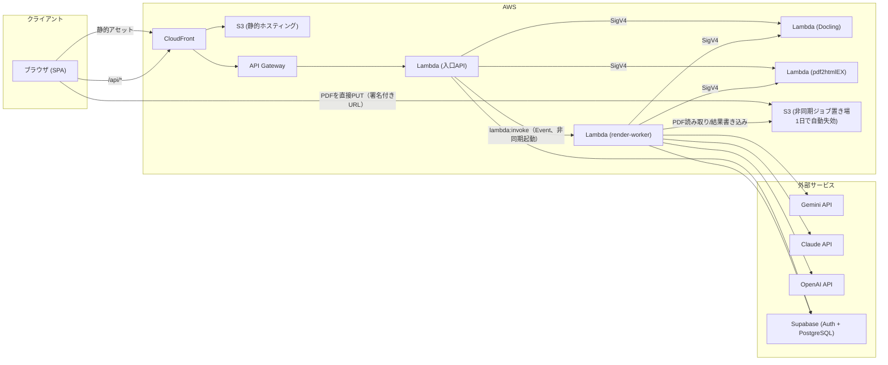
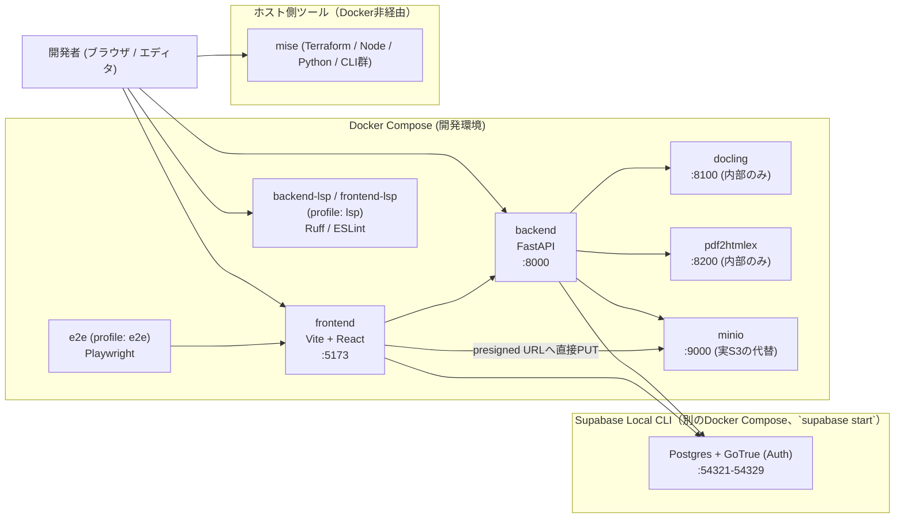
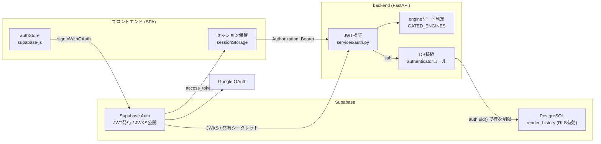
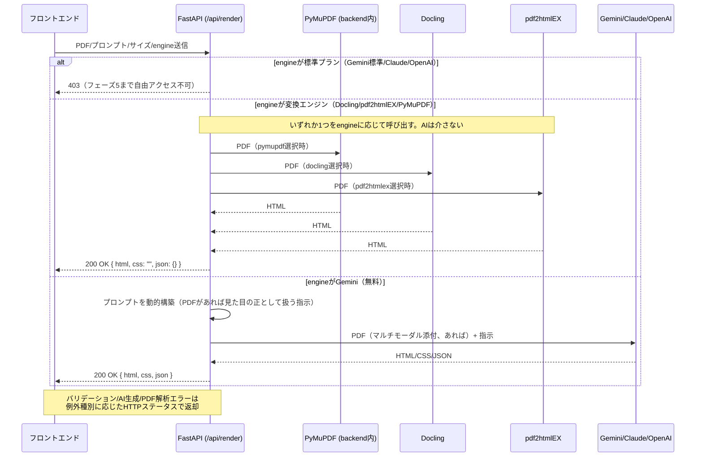
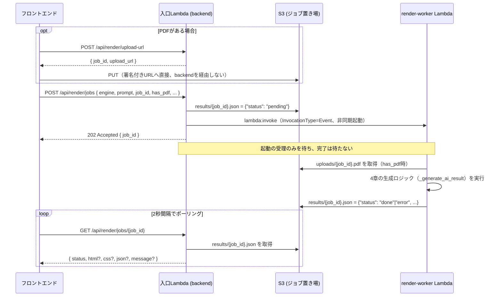
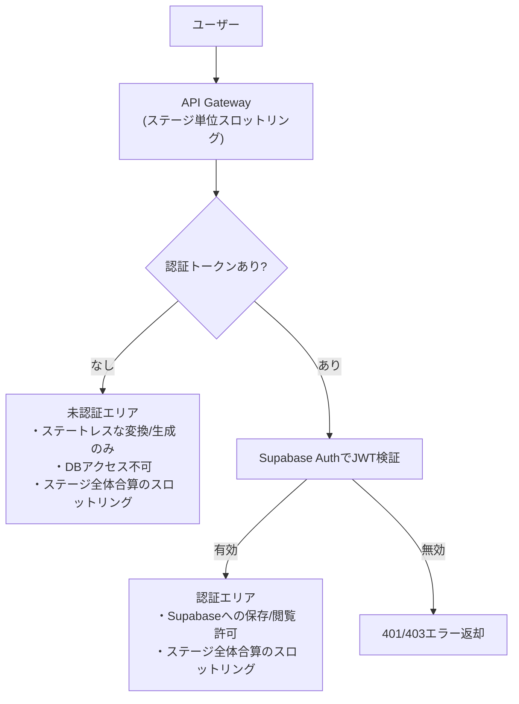
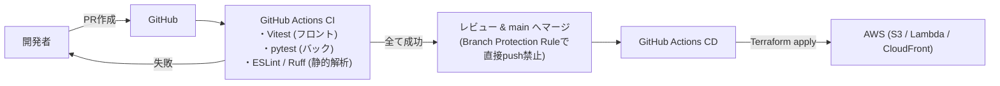
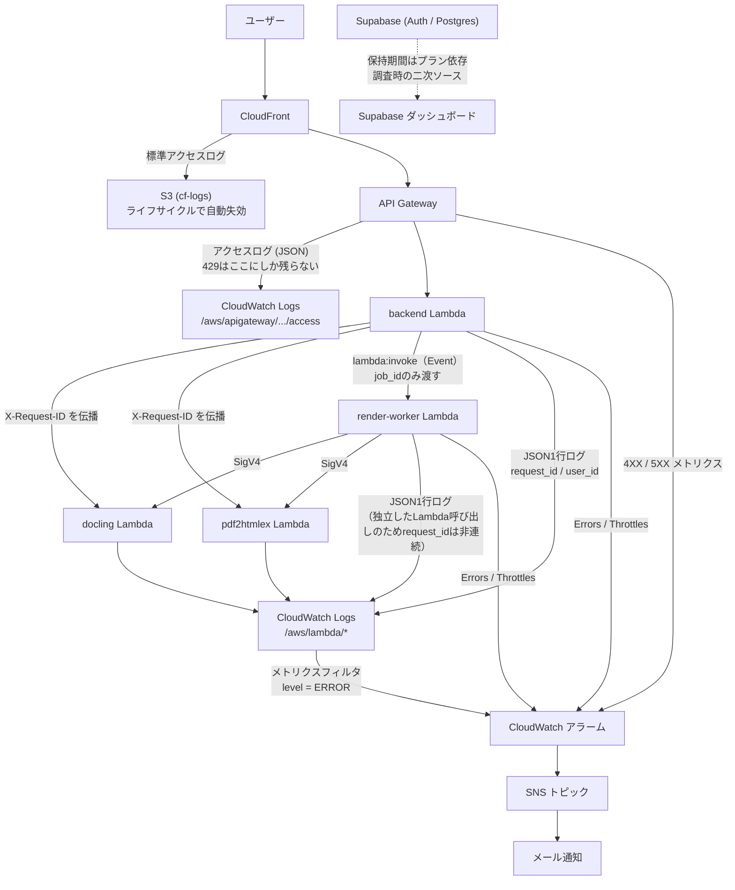

# アーキテクチャ設計書

`adapt-sheet` のシステム構成・API設計・セキュリティ・CI/CDの概要をMermaid.jsで記述する。技術選定の理由は [`decisions.md`](./decisions.md) を参照。

---

## 1. システム構成図

本番環境の構成要素と接続関係のみを示す（処理の分岐やゲート判定は「4. バックエンドAPI設計概要図」を参照）。

```mermaid
flowchart LR
    subgraph Client["クライアント"]
        Browser["ブラウザ (SPA)"]
    end

    subgraph AWS["AWS"]
        CF["CloudFront"]
        S3["S3 (静的ホスティング)"]
        APIGW["API Gateway"]
        LambdaEntry["Lambda (入口API)"]
        LambdaWorker["Lambda (render-worker)"]
        LambdaDocling["Lambda (Docling)"]
        LambdaPdf2HtmlEx["Lambda (pdf2htmlEX)"]
        S3Jobs["S3 (非同期ジョブ置き場<br/>1日で自動失効)"]
    end

    subgraph External["外部サービス"]
        Gemini["Gemini API"]
        Claude["Claude API"]
        OpenAI["OpenAI API"]
        Supabase["Supabase (Auth + PostgreSQL)"]
    end

    Browser -->|静的アセット| CF --> S3
    Browser -->|"/api/*"| CF --> APIGW --> LambdaEntry
    Browser -->|"PDFを直接PUT（署名付きURL）"| S3Jobs
    LambdaEntry -->|SigV4| LambdaDocling
    LambdaEntry -->|SigV4| LambdaPdf2HtmlEx
    LambdaEntry -->|"lambda:invoke（Event、非同期起動）"| LambdaWorker
    LambdaEntry --> Supabase
    LambdaWorker -->|"PDF読み取り/結果書き込み"| S3Jobs
    LambdaWorker -->|SigV4| LambdaDocling
    LambdaWorker -->|SigV4| LambdaPdf2HtmlEx
    LambdaWorker --> Gemini
    LambdaWorker --> Claude
    LambdaWorker --> OpenAI
    LambdaWorker --> Supabase
```

- フロントとAPIは同一オリジン（CloudFront配下の`/api/*`）で提供する。
- 入口Lambdaは`FastAPI + Lambda Web Adapter`で動き、PyMuPDFによるレイアウト変換を内包する。
- Docling/pdf2htmlEXの各Lambdaは内部専用で、API Gatewayを介さずAWS_IAM認証必須のFunction URLとして公開する。
- 生成AI（Gemini/Claude/OpenAI/hybrid）はAPI Gatewayの統合タイムアウト（29秒固定）に収まらないことがあるため、`render-worker`Lambda（入口Lambdaと同じイメージ、タイムアウト180秒）へ`lambda:invoke`（`InvocationType=Event`）で非同期起動し、API Gatewayを介さない経路で処理する（ADR-024）。PDFはS3の署名付きURLへブラウザから直接アップロードし、入口Lambdaを経由しない。生成AIへはPDFをマルチモーダル入力として直接添付する。
- 変換エンジン（Docling/pdf2htmlEX/PyMuPDF）は引き続き入口Lambda上で同期処理する（常に高速なため29秒制約を受けない）。

---

## 2. 開発環境の構成図

`docker compose up --build` で起動する開発環境（`docker-compose.yml`、ADR-010）。ホストへ公開するのは frontend(5173) と backend(8000) のみで、変換系サービスはCompose内部ネットワークからのみ到達できる。

```mermaid
flowchart LR
    Dev["開発者 (ブラウザ / エディタ)"]

    subgraph Compose["Docker Compose (開発環境)"]
        FE["frontend<br/>Vite + React<br/>:5173"]
        BE["backend<br/>FastAPI<br/>:8000"]
        DL["docling<br/>:8100 (内部のみ)"]
        PH["pdf2htmlex<br/>:8200 (内部のみ)"]
        MinIO["minio<br/>:9000 (実S3の代替)"]
        E2E["e2e (profile: e2e)<br/>Playwright"]
        LSP["backend-lsp / frontend-lsp<br/>(profile: lsp)<br/>Ruff / ESLint"]
    end

    subgraph SupaCompose["Supabase Local CLI（別のDocker Compose、`supabase start`）"]
        SB["Postgres + GoTrue (Auth)<br/>:54321-54329"]
    end

    subgraph Host["ホスト側ツール（Docker非経由）"]
        Mise["mise (Terraform / Node / Python / CLI群)"]
    end

    Dev --> FE
    Dev --> BE
    Dev --> LSP
    FE --> BE
    BE --> DL
    BE --> PH
    BE --> MinIO
    FE -->|"presigned URLへ直接PUT"| MinIO
    BE --> SB
    FE --> SB
    E2E --> FE
    Dev --> Mise
```

- 生成AIはpytest・ローカル開発とも既定でモック（`USE_MOCK_AI=true`）を経由し、実APIを叩かない。
- `e2e` と `*-lsp` は `profiles` によるopt-inで、常時起動しない（ADR-010/024）。
- Docling用のMLモデルは名前付きボリュームへ永続化し、コンテナ再作成時の再ダウンロードを避ける。
- ホスト側ツールのバージョンは `mise.toml` で固定する（ADR-023）。
- Supabase Local CLIも内部的にはDockerコンテナ（Postgres・GoTrue等）を起動するが、この`docker-compose.yml`とは別スタックのため図でも分けている（詳細手順は[`supabase-local-cli-setup.md`](./supabase-local-cli-setup.md)）。

---

## 3. 認証認可の仕組みの構成図

認証はSupabase Auth（Google OAuth、認可コード＋PKCE）に委譲し、バックエンドはJWTを検証するだけでセッションを持たない（ADR-020/021）。

```mermaid
flowchart LR
    subgraph Front["フロントエンド (SPA)"]
        AuthStore["authStore<br/>supabase-js"]
        Session["セッション保管<br/>sessionStorage"]
    end

    subgraph SupabaseSvc["Supabase"]
        SBAuth["Supabase Auth<br/>JWT発行 / JWKS公開"]
        SBDB["PostgreSQL<br/>render_history (RLS有効)"]
    end

    subgraph Backend["backend (FastAPI)"]
        Verify["JWT検証<br/>services/auth.py"]
        Gate["engineゲート判定<br/>GATED_ENGINES"]
        DBConn["DB接続<br/>authenticatorロール"]
    end

    Google["Google OAuth"]

    AuthStore -->|signInWithOAuth| SBAuth
    SBAuth --> Google
    SBAuth -->|access_token| Session
    Session -->|"Authorization: Bearer"| Verify
    SBAuth -->|"JWKS / 共有シークレット"| Verify
    Verify --> Gate
    Verify -->|sub| DBConn
    DBConn -->|"auth.uid() で行を制限"| SBDB
```

- トークンは `sessionStorage` に保持し、タブを閉じた時点で破棄する（ADR-020）。
- 検証鍵は署名方式で切り替わる（`HS256`は共有シークレット、`ES256`/`RS256`はJWKS。ADR-020）。設定が無い場合は常に未ログイン扱い（fail-closed）。
- 認可は2段構え。ゲート対象engine（`gemini`/`claude`/`openai`）は未ログインなら403 `FREE_ACCESS_FORBIDDEN`、履歴データはPostgreSQLのRLSで`auth.uid()`一致行のみに制限する（ADR-020）。
- アカウント作成は `scripts/create_user.sh` のみで、画面からの新規登録は提供しない（ADR-020）。

---

## 4. バックエンドAPI設計概要図

`POST /api/render` の処理フロー（詳細仕様は [`spec.md`](./spec.md) 参照）。生成AI系engineの実際の処理（`_generate_ai_result`）はこの図の通りだが、フロントは「4.1 非同期レンダリングジョブ」の経路でこれを呼び出す。`POST /api/render`自体は変換エンジン向けの同期経路として引き続き提供する。

エンジン選択（`engine`）により処理が3方向に分岐する。生成AI（Gemini/Claude/OpenAI/hybrid）はPDFをマルチモーダル入力として直接受け取り、PyMuPDF/Doclingによる事前変換は行わない（HTML/JSON/Doclingテキストは生成AIへ送らない）。Docling/pdf2htmlEX/PyMuPDFはAIを介さず、変換結果をそのまま描画結果として返す。

```mermaid
sequenceDiagram
    participant FE as フロントエンド
    participant API as FastAPI (/api/render)
    participant Layout as PyMuPDF (backend内)
    participant Docling as Docling
    participant Pdf2HtmlEx as pdf2htmlEX
    participant AI as Gemini/Claude/OpenAI

    FE->>API: PDF/プロンプト/サイズ/engine送信
    alt engineが標準プラン（Gemini標準/Claude/OpenAI）
        API-->>FE: 403（フェーズ5まで自由アクセス不可）
    else engineが変換エンジン（Docling/pdf2htmlEX/PyMuPDF）
        Note over API,Pdf2HtmlEx: いずれか1つをengineに応じて呼び出す。AIは介さない
        API->>Layout: PDF（pymupdf選択時）
        API->>Docling: PDF（docling選択時）
        API->>Pdf2HtmlEx: PDF（pdf2htmlex選択時）
        Layout-->>API: HTML
        Docling-->>API: HTML
        Pdf2HtmlEx-->>API: HTML
        API-->>FE: 200 OK { html, css: "", json: {} }
    else engineがGemini（無料）
        API->>API: プロンプトを動的構築（PDFがあれば見た目の正として扱う指示）
        API->>AI: PDF（マルチモーダル添付、あれば）+ 指示
        AI-->>API: HTML/CSS/JSON
        API-->>FE: 200 OK { html, css, json }
    end
    Note over API,FE: バリデーション/AI生成/PDF解析エラーは<br/>例外種別に応じたHTTPステータスで返却
```

---

## 4.1 非同期レンダリングジョブ（生成AI系engine）

生成AI系engine（`gemini_free`/`gemini`/`claude`/`openai`/`hybrid`）は、Gemini APIが20〜60秒以上かかることがあり、API Gatewayの統合タイムアウト（29秒固定・AWS側のハード上限）に収まらない場合がある。これを回避するため、フロントはこれらのengineでは`POST /api/render`を直接呼ばず、以下の非同期ジョブ経路を使う（詳細仕様は [`spec.md`](./spec.md) 3.1a参照）。変換エンジン（Docling/pdf2htmlEX/PyMuPDF）は引き続き上記4章の同期経路のままで変更しない。

```mermaid
sequenceDiagram
    participant FE as フロントエンド
    participant API as 入口Lambda (backend)
    participant S3 as S3 (ジョブ置き場)
    participant Worker as render-worker Lambda

    opt PDFがある場合
        FE->>API: POST /api/render/upload-url
        API-->>FE: { job_id, upload_url }
        FE->>S3: PUT（署名付きURLへ直接、backendを経由しない）
    end
    FE->>API: POST /api/render/jobs { engine, prompt, job_id, has_pdf, ... }
    API->>S3: results/{job_id}.json = {"status": "pending"}
    API->>Worker: lambda:invoke（InvocationType=Event、非同期起動）
    API-->>FE: 202 Accepted { job_id }
    Note over API,Worker: 起動の受理のみを待ち、完了は待たない
    Worker->>S3: uploads/{job_id}.pdf を取得（has_pdf時）
    Worker->>Worker: 4章の生成ロジック（_generate_ai_result）を実行
    Worker->>S3: results/{job_id}.json = {"status": "done"|"error", ...}
    loop 2秒間隔でポーリング
        FE->>API: GET /api/render/jobs/{job_id}
        API->>S3: results/{job_id}.json を取得
        API-->>FE: { status, html?, css?, json?, message? }
    end
```

- `render-worker`はAPI Gateway/Function URLを経由しないIAM専用のLambdaのため、入口Lambda（backend）以外からは呼び出せない。
- `POST /api/render/jobs`のゲート判定（`GATED_ENGINES`）は入口Lambda側で同期的に行い、即座に403を返せる（ジョブは起動しない）。
- `uploads/*`・`results/*`とも1日で自動失効するライフサイクルルールを持つ（PDFに業務データを含むため無期限に残さない）。
- S3の署名付きURLはリージョナルエンドポイント（`s3.<region>.amazonaws.com`）で発行する。グローバルエンドポイントだと307リダイレクトが発生し、ブラウザの`fetch`がクロスオリジンリダイレクトを安定して扱えないため。
- フロントのCSP（`connect-src`）にS3のリージョナルエンドポイントを許可している（`frontend/vite.config.ts`）。

---

## 5. セキュリティ概要図

未認証エリアと認証エリアのアクセス制御の違い（詳細は [`spec.md`](./spec.md) の要件、決定理由は [`decisions.md`](./decisions.md) を参照）。API Gatewayのステージ単位スロットリングはIPアドレスやユーザーIDを区別せず全体合算でカウントする点に注意。

```mermaid
flowchart TD
    User["ユーザー"] --> APIGW["API Gateway<br/>(ステージ単位スロットリング)"]
    APIGW --> Router{"認証トークンあり?"}

    Router -->|なし| Public["未認証エリア<br/>・ステートレスな変換/生成のみ<br/>・DBアクセス不可<br/>・ステージ全体合算のスロットリング"]
    Router -->|あり| SupabaseAuthCheck["Supabase AuthでJWT検証"]
    SupabaseAuthCheck -->|有効| Private["認証エリア<br/>・Supabaseへの保存/閲覧許可<br/>・ステージ全体合算のスロットリング"]
    SupabaseAuthCheck -->|無効| Reject["401/403エラー返却"]
```

---

## 6. CI/CD概要図

```mermaid
flowchart LR
    Dev["開発者"] -->|PR作成| GitHub["GitHub"]
    GitHub --> CI["GitHub Actions CI<br/>・Vitest (フロント)<br/>・pytest (バック)<br/>・ESLint / Ruff (静的解析)"]
    CI -->|全て成功| Review["レビュー & main へマージ<br/>(Branch Protection Ruleで直接push禁止)"]
    CI -->|失敗| Dev
    Review --> CD["GitHub Actions CD"]
    CD -->|"Terraform apply"| AWSInfra["AWS (S3 / Lambda / CloudFront)"]
```

---

## 7. データベース（PostgreSQL、ステップ28）

`render_history`テーブル（`backend/app/models.py`）のみ。登録ユーザーが`POST /api/render`を成功させるたびに1行追加される。`user_id`はSupabase Auth（`auth.users.id`）のUUIDをそのまま文字列で持つが、本DBは`auth`スキーマを所有しないため外部キー制約は張らない。

| カラム | 型 | 説明 |
|---|---|---|
| `id` | UUID (PK) | 履歴の一意識別子 |
| `user_id` | string | Supabase JWTの`sub`（`auth.users.id`） |
| `engine` | string | 描画に使ったエンジン（`RenderEngine`のいずれか） |
| `html` / `css` / `json_data` | text / text / json | `POST /api/render`のレスポンスと同一内容 |
| `width_mm` / `height_mm` | float, nullable | 帳票サイズ |
| `created_at` | timestamptz | 保存日時 |

マイグレーションは`backend/migrations/`（Alembic）で管理する。

## 8. ログ・可観測性の構成図（ADR-011）

記録先はCloudWatch（＋CloudFrontログのS3）へ寄せ、Supabase側のログは二次ソースと位置づける。運用手順は [`observability.md`](./observability.md) を参照。

```mermaid
flowchart TD
    User["ユーザー"] --> CF["CloudFront"]
    CF -->|"標準アクセスログ"| S3Logs["S3 (cf-logs)<br/>ライフサイクルで自動失効"]
    CF --> APIGW["API Gateway"]
    APIGW -->|"アクセスログ (JSON)<br/>429はここにしか残らない"| CWApi["CloudWatch Logs<br/>/aws/apigateway/.../access"]
    APIGW --> Backend["backend Lambda"]

    Backend -->|"X-Request-ID を伝播"| Docling["docling Lambda"]
    Backend -->|"X-Request-ID を伝播"| P2H["pdf2htmlex Lambda"]
    Backend -->|"lambda:invoke（Event）<br/>job_idのみ渡す"| Worker["render-worker Lambda"]
    Worker -->|SigV4| Docling
    Worker -->|SigV4| P2H

    Backend -->|"JSON1行ログ<br/>request_id / user_id"| CWApp["CloudWatch Logs<br/>/aws/lambda/*"]
    Docling --> CWApp
    P2H --> CWApp
    Worker -->|"JSON1行ログ<br/>（独立したLambda呼び出しのためrequest_idは非連続）"| CWApp

    CWApp -->|"メトリクスフィルタ<br/>level = ERROR"| Alarm["CloudWatch アラーム"]
    APIGW -->|"4XX / 5XX メトリクス"| Alarm
    Backend -->|"Errors / Throttles"| Alarm
    Worker -->|"Errors / Throttles"| Alarm
    Alarm --> SNS["SNS トピック"] --> Mail["メール通知"]

    Supabase["Supabase (Auth / Postgres)"] -.->|"保持期間はプラン依存<br/>調査時の二次ソース"| Dashboard["Supabase ダッシュボード"]
```

相関のたどり方: 画面のエラーに出る`request_id`（＝レスポンスの`X-Request-ID`）でbackend・docling・pdf2htmlexの3ロググループを横断検索できる。API Gatewayのアクセスログとの突き合わせは`xrayTraceId`で行う。`render-worker`は`lambda:invoke`（Event）による非同期起動のため独立したLambda実行コンテキストとなり、`X-Request-ID`は伝播しない。ジョブ単位の相関は`job_id`（`POST /api/render/jobs`のレスポンス、S3オブジェクトキー`uploads/{job_id}.pdf`・`results/{job_id}.json`と共通）で行う。

---

## 9. 今後の追記予定

- 名前付きテンプレート機能を追加する際、テーブル設計を拡張する。
