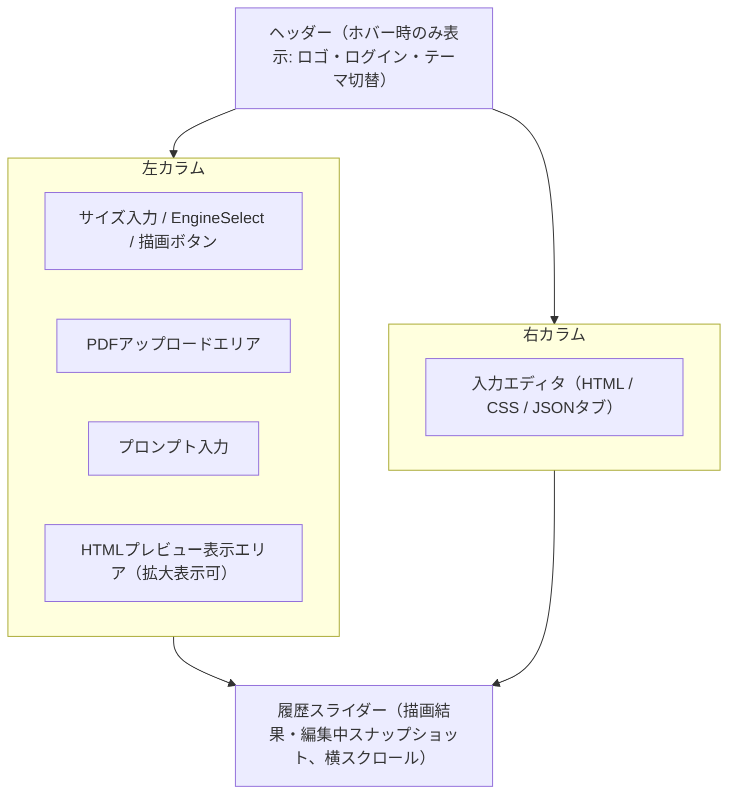

# 要件仕様書

`adapt-sheet` の要件定義・画面仕様・APIインターフェース・エラーコード定義をまとめる。背景・構想は [`../planning/brainstorm.md`](../planning/brainstorm.md) を参照。

---

## 1. プロダクト概要

エンジニアが保守しやすいHTML/CSS帳票を、AIの力で構築・管理するプラットフォーム。生成AI（Gemini/Claude/OpenAI、PDFを直接読み取るマルチモーダル入力）と、AIを介さない変換エンジン（Docling/pdf2htmlEX/PyMuPDF）を描画ボタンの隣で選べるモデル選択機能、リアルタイムプレビューを統合したSPA。

### 対象ユーザー

- **未認証ユーザー**: アカウント登録なしで帳票の生成・プレビューを試せる（データ保存は不可）。
- **登録ユーザー**: Supabase Authでログインし、`POST /api/render`成功時に生成履歴が自動的にSupabase（PostgreSQL）へ保存される。保存済み履歴は`HistorySlider`（最大10件、セッション切れ後もログイン確定時に再取得）と`HistoryArchive`（それより古い過去データ、最大50件）で閲覧できる。名前付きテンプレート機能は未実装。

---

## 2. 画面仕様

### 2.1 画面構成要素

| # | 要素 | 説明 |
|---|---|---|
| 1 | HTMLプレビュー表示エリア | 生成されたHTML/CSSをレスポンシブに描画するiframe等のコンポーネント |
| 2 | 入力エディタ | HTML入力 / CSS入力 / JSON入力（3タブ切り替え、いずれも独立したAPIリクエストフィールドは持たない）と、独立したプロンプト入力欄（`prompt`としてAPIへ送信される）。CSSはHTMLの`<style>`とは別入力だが、プレビュー合成時にHTML末尾の`<style>`へ結合される |
| 3 | ファイル操作 | PDFアップロードエリア（ドラッグ＆ドロップ対応） |
| 4 | コントロール | 縦幅・横幅サイズ入力、生成エンジン選択（EngineSelect）、描画ボタン |

画面はヘッダー（ホバー時のみ表示）の下に左右2カラム（md未満は縦積み）、最下部に横断の履歴スライダーを配置する構成。



### 2.2 主要機能

#### リアルタイム双方向プレビュー
- HTML/CSS/JSONの変更をリアルタイムに検知し、帳票プレビューに即座に反映する。
- 画面幅に応じたアスペクト比固定スケーリング（PC/iPhoneでそれぞれ最小/最大サイズを設定）。

#### インテリジェントテンプレート連動
- HTML内のテンプレート変数とJSONのキーを柔軟にマッピングする。
- タイトル等の固定情報はHTMLに直接記述し、明細データ等の業務データのみをJSONと連動させる（[CLAUDE.md](../CLAUDE.md) のコード規約に準拠）。

#### 定型サイズ自動入力
- A4たて/A4よこ/B5たて/B5よこ/A5たて/A5よこの6択を1つのSelect（トリガー+ドロップダウン、標準的なBase UIのSelectの見た目・挙動をそのまま使う）に統合する。各選択肢・トリガーの中身は、実寸(mm)の縦横比をそのまま反映した紙のイラスト+サイズ名(A4/B5/A5)。「たて」「よこ」の文字ラベルやmm表記は画面上に表示せず、方向はイラストの縦横比のみで表現する（アクセシブルネームはaria-labelで別途保持）。選択時、対応する縦横の寸法を自動入力する。初期値はA4たて（幅210mm・高さ297mm）。幅・高さの手動入力等どのプリセットとも一致しない寸法のときは、トリガーのイラストは常に1:1の固定正方形・サイズ名の表記が無い無印になる。

| サイズ | たて (mm) | よこ (mm) |
|---|---|---|
| A4 | 297 | 210 |
| A5 | 210 | 148 |
| B5 | 257 | 182 |

#### 履歴スライド機能
- 描画ボタン押下時、PDF・プロンプト・サイズ・生成エンジン選択をAPIへ送信する（CSS・JSON・HTMLは独立フィールドを持たない）。
- レスポンス（HTML/CSS/JSON）を反映し、再描画時は過去の描画内容を最大10件まで横にスライドしてスタックする（11件目以降は最も古い履歴を破棄）。
- エディタ（HTML/CSS/JSON）を編集した場合も、入力が止まった区切りで「編集中」のスナップショットとして同じ履歴へ積む。描画結果と同じ10件枠を共有し、点線枠と「編集中」バッジで描画結果と区別する。ログイン時はサーバー側の履歴にも`kind="edit"`として保存する。
- 編集中のスナップショットを続けて編集した場合は履歴を追加せず、その1件を最新内容へ更新する。新しい「編集中」が増えるのは、描画結果を編集したとき、または描画履歴を復元して編集したときのみ。

#### インテリジェントメッセージ表示
- バックエンドAPIのステータスコード（4xx, 5xx等）に準拠したエラー/成功メッセージをトースト等で表示する。

#### 描画中の進捗表示
- Docling解析（PDFアップロード時）は数秒〜十数秒かかることがあるため、描画ボタン押下から完了までの間は「描画中...(N秒)」の形式で経過秒数を1秒ごとに表示し、処理が進行中であることを伝える。

---

## 3. APIインターフェース

### 3.1 `POST /api/render`

PDF・プロンプト・サイズ指定・生成エンジン選択を受け取り、選択したエンジンに応じてHTML/CSS/JSONを返却する中核エンドポイント。

**リクエスト（multipart/form-data）**

| フィールド | 型 | 必須 | 説明 |
|---|---|---|---|
| `pdf` | file | 任意 | ベースとなる既存PDF。`docling`/`pdf2htmlex`/`pymupdf`選択時は必須（無いと400） |
| `prompt` | string | 任意 | 生成方針の自然言語指示（生成AI選択時のみ使用） |
| `width_mm` | number | 任意 | 帳票の横幅（mm） |
| `height_mm` | number | 任意 | 帳票の縦幅（mm） |
| `engine` | string | 任意 | 生成エンジン。`gemini_free`（既定）/`gemini`/`claude`/`openai`/`hybrid`/`docling`/`pdf2htmlex`/`pymupdf`のいずれか |

> `css`・`json`（業務データ）・`html`（既存HTML）はいずれも独立したリクエストフィールドを持たない。生成AIへはPDFファイルをそのままマルチモーダル入力として渡し、PyMuPDF由来のHTMLやDocling由来のテキストを事前変換して渡すことはしない。
> `engine`が`gemini`/`claude`/`openai`（標準プラン）の場合、未ログインユーザーには`403 FREE_ACCESS_FORBIDDEN`を返す（4章参照）。ログイン済みかどうかは`Authorization: Bearer <Supabaseアクセストークン>`ヘッダーの有効性で判定する。
> このエンドポイント自体はAPI Gatewayの統合タイムアウト（29秒固定）を受ける同期処理のため、フロントは生成AI系engine（`gemini_free`/`gemini`/`claude`/`openai`/`hybrid`）ではこのエンドポイントを直接呼ばず、3.1a「非同期レンダリングジョブ」を経由する。変換エンジン（`docling`/`pdf2htmlex`/`pymupdf`）は引き続きこのエンドポイントを直接呼ぶ。

**レスポンス（200 OK）**

```json
{
  "html": "<!doctype html>...",
  "css": "body { ... }",
  "json": { "invoice_no": "{{invoice_no}}" }
}
```

> `engine`が変換エンジン（`docling`/`pdf2htmlex`/`pymupdf`）の場合、AIを介さず各エンジンの変換結果をそのまま`html`に、`css`は空文字列、`json`は空オブジェクトとして返す。

### 3.1a 非同期レンダリングジョブ（生成AI系engine）

生成AI系engine（`gemini_free`/`gemini`/`claude`/`openai`/`hybrid`）はAPI Gatewayの29秒制約を受けないよう、3つのエンドポイントを組み合わせた非同期ジョブとして描画する。処理フローの全体像は[`architecture.md`](./architecture.md#41-非同期レンダリングジョブ生成ai系engine)を参照。

#### `POST /api/render/upload-url`

PDFをS3へ直接アップロードするための署名付きURLを発行する。PDFを添付する場合のみ、`POST /api/render/jobs`より先に呼ぶ。認証不要・リクエストボディなし。

**レスポンス（200 OK）**

```json
{ "job_id": "9b605914-8927-4c45-bcba-0515801beb0c", "upload_url": "https://s3.ap-northeast-1.amazonaws.com/..." }
```

呼び出し側は`upload_url`へPDFを`PUT`する（`Content-Type: application/pdf`、backendを経由しない）。有効期限は300秒。

#### `POST /api/render/jobs`

描画ジョブを起動する。ゲート対象engine（`gemini`/`claude`/`openai`）の未ログイン判定は`POST /api/render`と同じくここで同期的に行う。

**リクエスト（application/json）**

| フィールド | 型 | 必須 | 説明 |
|---|---|---|---|
| `prompt` | string | 任意 | 生成方針の自然言語指示 |
| `width_mm` / `height_mm` | number | 任意 | 帳票の横幅・縦幅（mm） |
| `engine` | string | 任意 | 生成エンジン。既定は`gemini_free` |
| `current_html` / `current_json` | string | 任意 | PDF未添付時のみ使う、画面に表示中のHTML/JSON |
| `job_id` | string | 任意 | `POST /api/render/upload-url`で得たjob_idを指定すると、そのアップロード済みPDFを使う |
| `has_pdf` | boolean | 任意 | `true`の場合、`job_id`のアップロード済みPDFをS3から取得して使う（既定`false`） |

**レスポンス（202 Accepted）**

```json
{ "job_id": "9b605914-8927-4c45-bcba-0515801beb0c" }
```

`job_id`未指定の場合はサーバー側で新規発行する。レスポンスは受理のみを表し、描画の完了は待たない。

#### `GET /api/render/jobs/{job_id}`

ジョブの状態を取得する。フロントは`status`が`pending`の間、2秒間隔で呼び直す。

**レスポンス（200 OK）**

```json
{ "status": "done", "html": "<!doctype html>...", "css": "body { ... }", "json": { "invoice_no": "..." }, "message": null }
```

| `status` | 説明 |
|---|---|
| `pending` | 処理中。`html`/`css`/`json`/`message`はすべて`null` |
| `done` | 完了。`html`/`css`/`json`にPOST /api/renderと同じ内容が入る |
| `error` | 失敗。`message`にユーザー向けの安全な日本語文言が入る（バリデーションエラー・AI生成エラー・PDF解析エラーいずれも同じ`message`フィールドに統一し、HTTPステータスでは区別しない。ジョブ自体のHTTP応答は常に200） |

存在しない`job_id`（発行から1日以上経過し自動失効した場合を含む）には`404`を返す。

### 3.2 `POST /convert`（docling-service、内部API）

Docling変換専用のサービスが公開する内部エンドポイント。ホストへはポートを公開せず、Docker Compose内部ネットワーク経由で`backend`からのみ呼び出される想定のため、CORS設定・認証は行わない。

**リクエスト（multipart/form-data）**

| フィールド | 型 | 必須 | 説明 |
|---|---|---|---|
| `file` | file | 必須 | 変換対象のPDF |

**レスポンス（200 OK）**

```json
{
  "html": "<!doctype html>..."
}
```

**エラー**

| HTTPステータス | 説明 |
|---|---|
| `422 Unprocessable Entity` | PDFの構造が破損している等でDoclingによる変換に失敗（`detail`にエラーメッセージを含む素のFastAPIエラー形式。`backend`側の`RemoteDoclingHtmlExtractor`がこれを検知し、`PDF_CONVERSION_ERROR`として4.1の統一エラー形式に整形した上で`/api/render`のレスポンスに反映する） |

### 3.3 `POST /convert`（pdf2htmlex-service、内部API）

pdf2htmlEX変換専用のサービスが公開する内部エンドポイント。docling-service（3.2）と同じ設計方針で、ホストへはポートを公開せず、Docker Compose内部ネットワーク経由で`backend`からのみ呼び出される。

**リクエスト（multipart/form-data）**

| フィールド | 型 | 必須 | 説明 |
|---|---|---|---|
| `file` | file | 必須 | 変換対象のPDF |

**レスポンス（200 OK）**

```json
{
  "html": "<!doctype html>..."
}
```

**エラー**

| HTTPステータス | 説明 |
|---|---|
| `422 Unprocessable Entity` | PDFの構造が破損している等でpdf2htmlEXによる変換に失敗（`backend`側の`RemotePdf2HtmlExExtractor`がこれを検知し、`PDF_CONVERSION_ERROR`として4.1の統一エラー形式に整形した上で`/api/render`のレスポンスに反映する） |

### 3.4 GET /api/history（登録ユーザー限定）

ログイン中のユーザーが`POST /api/render`で成功させた生成履歴を、新しい順に最大50件返す。`POST /api/render`成功時にサーバー側で自動保存されるため、専用の保存操作（保存ボタン等）はない。

**リクエスト**

`Authorization: Bearer <Supabaseアクセストークン>`ヘッダーが必須。未ログイン（ヘッダー無し・無効なトークン）の場合は`403 FREE_ACCESS_FORBIDDEN`を返す（4章参照）。

**レスポンス（200 OK）**

```json
[
  {
    "id": "9b605914-8927-4c45-bcba-0515801beb0c",
    "engine": "gemini_free",
    "html": "<!doctype html>...",
    "css": "body { ... }",
    "json": { "customer_name": "..." },
    "width_mm": 210.0,
    "height_mm": 297.0,
    "created_at": "2026-07-20T09:04:58.666018+00:00"
  }
]
```

> 未ログイン時に`POST /api/render`が成功しても履歴は保存されない。DB保存自体が失敗した場合も`POST /api/render`のレスポンスには影響しない（描画の成否とDB保存の成否を切り離す）。

### 3.5 `POST /api/warmup`（ホットスタンバイ）

フロントの画面表示時に一度だけ呼ばれ、コールドスタートしがちな依存先を起こしておくためのエンドポイント。認証不要・リクエストボディなし。

- `docling` / `pdf2htmlex`: 各サービスの`GET /health`をbackendが代理で叩く（IAM認証必須のLambda Function URLのためフロントからは直接叩けない）
- `database`: SupabaseのPostgresへ`SELECT 1`（無料プロジェクトの一時停止を避けるキープアライブ）

**レスポンス（常に200 OK）**

```json
{ "docling": "ok", "pdf2htmlex": "ok", "database": "ok" }
```

各値は`"ok"`または`"unavailable"`。ウォームアップの結果は画面の挙動を左右しないため、いずれかが失敗しても200を返し、エラーレスポンス（4章）にはしない（サーバー側はWARNINGログを残す）。`DATABASE_URL`未設定のローカル/pytestでは`database`は常に`"unavailable"`になる。

#### `GET /health`（docling-service / pdf2htmlex-service、内部API）

上記のウォームアップ専用。PDF変換の依存には触れず`{"status": "ok"}`を即座に返す。

### 3.6 型同期

FastAPIが自動生成する `openapi.json` からフロントエンド用のTypeScript型定義を生成し、フロント・バック間でキー名の手書き一致を排除する（[CLAUDE.md](../CLAUDE.md) 参照）。

- `backend/scripts/export_openapi.py`: サーバー起動なしで `app.openapi()` を `backend/openapi.json` へ書き出す
- `openapi-typescript`（`frontend`の`npm run generate-types`）: `backend/openapi.json` から `frontend/src/types/api.ts` を生成する

---

## 4. エラーコード定義

| HTTPステータス | `error.code` | ケース | 発生条件 |
|---|---|---|---|
| `400 Bad Request` | `VALIDATION_ERROR` | バリデーションエラー | 必須項目の欠如、サイズ指定の型不正、JSON構文エラーなど |
| `403 Forbidden` | `FREE_ACCESS_FORBIDDEN` | 標準プランの生成AI利用不可 | `engine`が`gemini`/`claude`/`openai`（標準プラン）で、フェーズ5のアカウント登録機能導入前 |
| `413 Payload Too Large` | `PAYLOAD_TOO_LARGE` | ファイルサイズ超過 | PDFアップロードサイズが上限を超過 |
| `428 Precondition Required` | `PDF_REQUIRED` | PDF未添付 | `engine`が変換エンジン（Docling/pdf2htmlEX/PyMuPDF）または`hybrid`で、PDFが添付されていない |
| `422 Unprocessable Entity` | `PDF_CONVERSION_ERROR` | PDF解析エラー | PDFの構造が破損している、パスワード保護されている等でDocling/pdf2htmlEX/PyMuPDFによる変換に失敗 |
| `429 Too Many Requests` | `RATE_LIMITED` | レート制限超過 | API Gatewayステージ全体（全利用者合算、認証有無に関わらず）のスロットリングに抵触 |
| `502 Bad Gateway` | `AI_GENERATION_ERROR` | AI生成エラー | Gemini/Claude/OpenAI API呼び出し失敗、タイムアウト、不正なレスポンス形式 |
| `503 Service Unavailable` | `AI_SERVICE_UNAVAILABLE` | 生成AIサービスの混雑 | Geminiが503 UNAVAILABLE（高負荷）を返し、リトライしても解消しなかった場合 |
| `501 Not Implemented` | `AI_SERVICE_SUSPENDED` | 標準プランの利用停止 | gemini/claude/openai/hybridのAPIキーが未設定（標準プラン未提供） |
| `500 Internal Server Error` | `INTERNAL_ERROR` | 想定外のサーバーエラー | 上記以外の未分類の例外 |

各エラーは例外種別に応じたステータスコードを厳格に返す（[CLAUDE.md](../CLAUDE.md) のエラーハンドリング規約に準拠）。

### 4.1 エラーレスポンス形式

すべてのエラー応答は、HTTPステータスに加えて次の構造化JSONボディを返す。フロントエンドはこの `message` をそのままユーザー向け文言として表示し、`request_id` を問い合わせ用に保持する（[CLAUDE.md](../CLAUDE.md) の型安全・エラーハンドリング規約に準拠）。

```json
{
  "error": {
    "code": "AI_GENERATION_ERROR",
    "message": "AIによる生成に失敗しました。しばらくしてから再度お試しください。",
    "request_id": "3f2b1c9a-4d5e-6f70-8a9b-0c1d2e3f4a5b"
  }
}
```

| フィールド | 型 | 説明 |
|---|---|---|
| `error.code` | string | 機械可読なエラー識別子（上表の `error.code` 列）。フロントの分岐処理に使う。 |
| `error.message` | string | ユーザーへ表示する安全な日本語文言。技術的詳細・スタックトレースは含めない。 |
| `error.request_id` | string | リクエスト単位の相関ID。同じ値が `X-Request-ID` レスポンスヘッダーおよびサーバーの構造化ログに出力され、障害調査時に画面表示とログを突き合わせられる。 |

- `message` はステータス／例外種別ごとに固定の安全文言へ丸める。バックエンドの生の例外メッセージ（英語や内部情報を含みうる）はサーバーログにのみ記録し、レスポンスには出さない。
- 成功・失敗を問わず全レスポンスに `X-Request-ID` ヘッダーを付与する。
